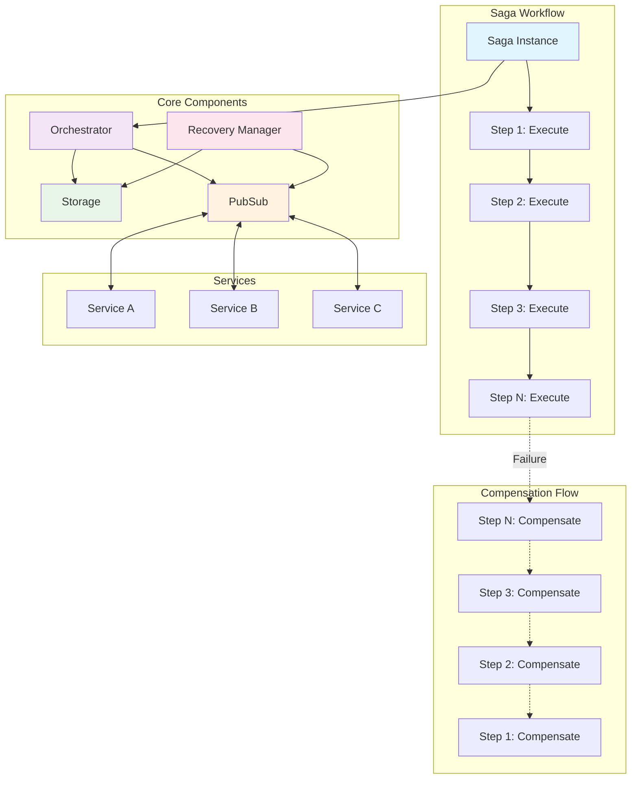

# go-saga

A Go library for distributed transactions using the Saga pattern. Orchestrates complex workflows across multiple services with automatic compensation on failures.

## Quick Start

```go
package main

import (
    "context"
    "fmt"
    "github.com/andrewnguyen41/saga-go"
)

func main() {
    // Setup
    storage := saga.NewMemoryStorage()
    pubsub := saga.NewMemoryPubSub()
    orchestrator := saga.NewOrchestrator(storage, pubsub)
    orchestrator.StartListener(context.Background())

    // Create saga with step definitions
    sagaInstance, err := saga.NewBuilder("order_process", orchestrator).
        Step("create_order",
            func(ctx context.Context, data map[string]interface{}) error {
                fmt.Printf("Creating order for user: %v\n", data["user_id"])
                data["order_id"] = "12345"
                return nil
            },
            func(ctx context.Context, data map[string]interface{}) error {
                fmt.Printf("Canceling order: %v\n", data["order_id"])
                return nil
            },
        ).
        Step("charge_payment",
            func(ctx context.Context, data map[string]interface{}) error {
                fmt.Printf("Charging payment for order: %v\n", data["order_id"])
                return nil
            },
            func(ctx context.Context, data map[string]interface{}) error {
                fmt.Printf("Refunding payment\n")
                return nil
            },
        ).
        WithData("user_id", "user_123").
        Execute(context.Background())
}
```

## Features

- Builder pattern API for step definitions
- Automatic compensation on step failures
- Pluggable storage backends (database, Redis, etc.)
- Service crash recovery and failover
- Distributed step processing across services

## Architecture

A saga represents a distributed transaction composed of sequential steps. Each step defines both execution logic and compensation logic for rollback scenarios.



### Core Components
- **Saga**: A workflow composed of multiple coordinated steps
- **Step**: Individual work unit with execute and compensate functions
- **Orchestrator**: Manages step execution, coordination, and failure handling
- **Storage**: Persistent state management for crash recovery

### Storage Interface
You'll need to implement this interface for your storage backend:
```go
type Storage interface {
    SaveSaga(ctx context.Context, saga *Saga) error
    GetSaga(ctx context.Context, id string) (*Saga, error)
    UpdateStep(ctx context.Context, step *Step) error
    GetStep(ctx context.Context, id string) (*Step, error)
    GetPendingSteps(ctx context.Context) ([]Step, error)
}
```

The library includes an in-memory storage implementation for development and testing. For production use, implement this interface with your preferred database.

#### Custom Storage Implementation
```go
type PostgreSQLStorage struct {
    db *sql.DB
}

func (p *PostgreSQLStorage) SaveSaga(ctx context.Context, saga *Saga) error {
    // Implement database persistence
    return nil
}

func (p *PostgreSQLStorage) GetSaga(ctx context.Context, id string) (*Saga, error) {
    // Implement database retrieval
    return nil, nil
}

// Configure with custom storage
storage := &PostgreSQLStorage{db: myDB}
orchestrator := saga.NewOrchestrator(storage, saga.NewMemoryPubSub())
```

### Messaging Interface
For distributed processing:
```go
type PubSub interface {
    Publish(ctx context.Context, topic string, msg Message) error
    Subscribe(ctx context.Context, topic string, handler func(Message)) error
    Close() error
}
```

## Crash Recovery

The library provides automatic recovery when service instances fail during step execution. Other instances can seamlessly continue the workflow.

```go
// Initialize recovery manager for fault tolerance
recovery := saga.NewRecoveryManager(storage, pubsub)
recovery.Start(ctx)
```

Recovery mechanism:
1. Step execution begins → status marked as "processing"
2. Service failure occurs → step remains in "processing" state
3. Recovery manager detects stuck steps → resets status to "pending"
4. Available service instances pick up pending work

## Examples

The `example/` directory contains working demonstrations of different saga patterns.

### Basic Example
Demonstrates a successful saga execution with order → payment → shipping workflow:

```bash
cd example/basic
go run main.go
```

### Failure Example
Shows automatic compensation when a step fails:

```bash
cd example/failure
go run main.go
```

### Recovery Example
Demonstrates saga recovery after service failure:

```bash
cd example/recovery
go run main.go
```

## License

MIT